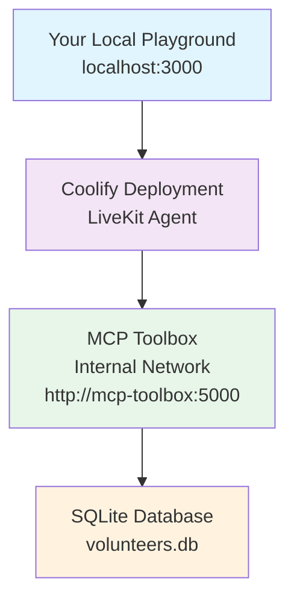

# 🚀 Coolify Full Deployment Guide

## ✅ You're All Set!

Your existing [`docker-compose.yml`](docker-compose.yml) is already perfect for deploying both the LiveKit agent and MCP Toolbox to Coolify.

## 📁 Files Ready for Deployment

### Required Files (already created):
- **[`docker-compose.yml`](docker-compose.yml)** - Main deployment configuration
- **[`Dockerfile`](Dockerfile)** - Agent container build instructions  
- **[`tools.yaml`](tools.yaml)** - MCP Toolbox configuration (7 elderly-focused tools)
- **[`volunteers.db`](volunteers.db)** - SQLite database with 6 sample volunteers
- **[`.dockerignore`](.dockerignore)** - Optimized build context

## 🔧 Coolify Deployment Steps

### 1. Create New Project in Coolify
- Log into your Coolify dashboard
- Create new project: "volunteer-management-system"
- Choose "Docker Compose" deployment type

### 2. Upload Project Files
- Upload all files from this directory to Coolify
- Ensure `docker-compose.yml` is recognized as the main compose file

### 3. Set Environment Variables in Coolify
```env
# LiveKit Connection (connect to your local playground or LiveKit Cloud)
LIVEKIT_URL=ws://your-livekit-server:7880
LIVEKIT_API_KEY=your-api-key
LIVEKIT_API_SECRET=your-api-secret

# Azure OpenAI Configuration
AZURE_DEPLOYMENT=your-deployment-name
AZURE_OPENAI_ENDPOINT=https://your-resource.openai.azure.com/
AZURE_OPENAI_API_KEY=your-api-key
OPENAI_API_VERSION=2024-02-15-preview

# Azure TTS Configuration
AZURE_TTS_DEPLOYMENT=your-tts-deployment
AZURE_TTS_ENDPOINT=https://your-tts-resource.cognitiveservices.azure.com/
AZURE_TTS_API_KEY=your-tts-api-key
AZURE_TTS_API_VERSION=2024-02-15-preview

# Deepgram Configuration
DEEPGRAM_API_KEY=your-deepgram-key
```

### 4. Deploy
- Click "Deploy" in Coolify
- Wait for both services to build and start
- Check logs for any errors

## 🔗 Connection Architecture



## ✅ Testing Your Deployment

### 1. Check Service Health
Both services have health checks that Coolify will monitor:
- **MCP Toolbox**: `http://mcp-toolbox:5000/health`
- **LiveKit Agent**: `http://livekit-agent:8081/health`

### 2. Test Agent Connection
1. Get your Coolify-assigned agent URL
2. Update your local playground to connect to: `wss://your-agent.coolify.app`
3. Join a room and test voice interaction

### 3. Verify Tools Work
Ask the agent: *"I need help with cooking in Accra"*
- Agent should search the volunteer database
- Should return volunteers with cooking skills in Accra
- Should provide contact information

## 🎯 Key Benefits of This Setup

- ✅ **Self-Hosted**: Full control on your Coolify server
- ✅ **Integrated**: Agent and toolbox communicate via internal Docker network
- ✅ **Scalable**: Can handle multiple concurrent users
- ✅ **Reliable**: Health checks and automatic restarts
- ✅ **Secure**: Internal network communication, no external dependencies

## 🐛 Troubleshooting

### Agent Won't Start
- Check all environment variables are set in Coolify
- Verify API keys are valid
- Check agent logs for specific errors

### MCP Toolbox Connection Failed
- Ensure both services are in the same Docker network
- Check that `TOOLBOX_URL=http://mcp-toolbox:5000` is set
- Verify MCP Toolbox service is healthy

### No Volunteers Found
- Check that `volunteers.db` file was uploaded
- Verify database has sample data
- Check `tools.yaml` configuration

## 🚀 You're Ready to Deploy!

Your system is perfectly configured for Coolify deployment. Just upload the files, set the environment variables, and deploy!

The existing [`docker-compose.yml`](docker-compose.yml) handles everything:
- Service orchestration
- Health checks  
- Internal networking
- Volume mounting
- Dependency management

No additional configuration needed! 🎉