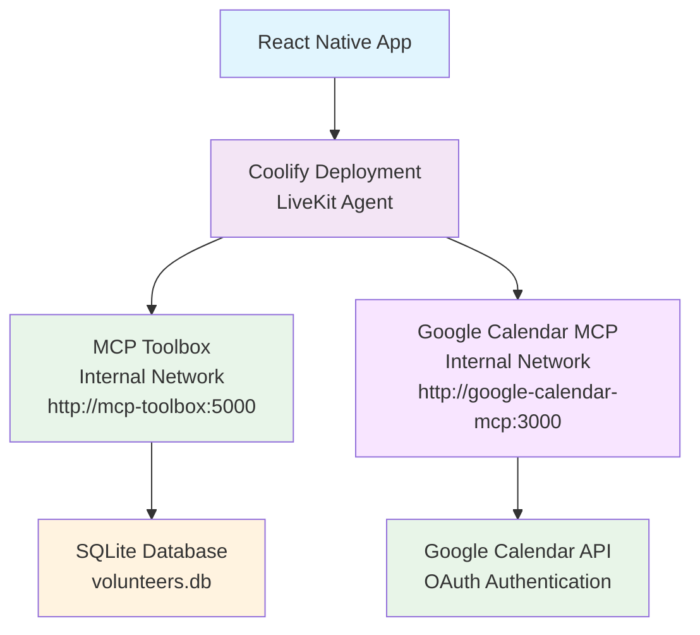

# 🚀 Coolify Full Deployment Guide

## ✅ You're All Set!

Your existing [`docker-compose.yml`](docker-compose.yml) is already perfect for deploying both the LiveKit agent and MCP Toolbox to Coolify.

## 📁 Files Ready for Deployment

### Required Files (already created):
- **[`docker-compose.yml`](docker-compose.yml)** - Main deployment configuration
- **[`Dockerfile`](Dockerfile)** - Agent container build instructions  
- **[`tools.yaml`](tools.yaml)** - MCP Toolbox configuration (7 elderly-focused tools)
- **[`volunteers.db`](volunteers.db)** - SQLite database with 6 sample volunteers
- **[`.dockerignore`](.dockerignore)** - Optimized build context

## 🔧 Coolify Deployment Steps

### 1. Create New Project in Coolify
- Log into your Coolify dashboard
- Create new project: "volunteer-management-system"
- Choose "Docker Compose" deployment type

### 2. Upload Project Files
- Upload all files from this directory to Coolify
- Ensure `docker-compose.yml` is recognized as the main compose file

### 3. Set Environment Variables in Coolify

**📋 Complete Environment Variables Setup:**

**Key Variables Include:**
```env
# Google Calendar OAuth (NEW!)
GOOGLE_CLIENT_ID=your-google-client-id
GOOGLE_CLIENT_SECRET=your-google-client-secret
GOOGLE_PROJECT_ID=your-google-project-id

# LiveKit Connection
LIVEKIT_URL=wss://your-livekit-server
LIVEKIT_API_KEY=your-api-key
LIVEKIT_API_SECRET=your-api-secret

# Azure OpenAI Configuration
AZURE_DEPLOYMENT=your-deployment-name
AZURE_OPENAI_ENDPOINT=https://your-resource.openai.azure.com/
AZURE_OPENAI_API_KEY=your-api-key
OPENAI_API_VERSION=2024-12-01-preview

# Azure TTS Configuration
AZURE_TTS_DEPLOYMENT=your-tts-deployment
AZURE_TTS_ENDPOINT=https://your-tts-resource.cognitiveservices.azure.com/
AZURE_TTS_API_KEY=your-tts-api-key
AZURE_TTS_API_VERSION=2025-03-01-preview

# Deepgram Configuration
DEEPGRAM_API_KEY=your-deepgram-key
```

⚠️ **Important**: The Google OAuth credentials are now handled via environment variables for security. Never commit `gcp-oauth.keys.json` to git!

### 4. Deploy
- Click "Deploy" in Coolify
- Wait for both services to build and start
- Check logs for any errors

## 🔗 Connection Architecture



## ✅ Testing Your Deployment

### 1. Check Service Health
All services have health checks that Coolify will monitor:
- **MCP Toolbox**: `http://mcp-toolbox:5000/health`
- **Google Calendar MCP**: `http://google-calendar-mcp:3000/health`
- **LiveKit Agent**: `http://livekit-agent:8081/health`

### 2. Complete Google Calendar Authentication
1. Check Google Calendar MCP logs in Coolify dashboard
2. Look for authentication URL in the logs
3. Open the URL in your browser and complete OAuth flow
4. Grant calendar permissions

### 3. Test Agent Connection
1. Connect your React Native app to the deployed voice agent
2. Test voice interaction with calendar features

### 4. Verify Complete Integration
Ask the agent: *"I need help with cooking in Accra"*
- Agent should search the volunteer database
- Should return volunteers with cooking skills in Accra
- Should provide contact information

Then ask: *"Can you schedule a checkup appointment with Dr. Joe for tomorrow at 2 PM?"*
- Agent should use Google Calendar MCP to create the appointment
- Should confirm the appointment details
- Should provide appointment summary

## 🎯 Key Benefits of This Setup

- ✅ **Self-Hosted**: Full control on your Coolify server
- ✅ **Integrated**: Agent and toolbox communicate via internal Docker network
- ✅ **Scalable**: Can handle multiple concurrent users
- ✅ **Reliable**: Health checks and automatic restarts
- ✅ **Secure**: Internal network communication, no external dependencies

## 🐛 Troubleshooting

### Agent Won't Start
- Check all environment variables are set in Coolify
- Verify API keys are valid
- Check agent logs for specific errors

### MCP Toolbox Connection Failed
- Ensure both services are in the same Docker network
- Check that `TOOLBOX_URL=http://mcp-toolbox:5000` is set
- Verify MCP Toolbox service is healthy

### No Volunteers Found
- Check that `volunteers.db` file was uploaded
- Verify database has sample data
- Check `tools.yaml` configuration

## 🚀 You're Ready to Deploy!

Your system is perfectly configured for Coolify deployment. Just upload the files, set the environment variables, and deploy!

The existing [`docker-compose.yml`](docker-compose.yml) handles everything:
- Service orchestration
- Health checks  
- Internal networking
- Volume mounting
- Dependency management

No additional configuration needed! 🎉